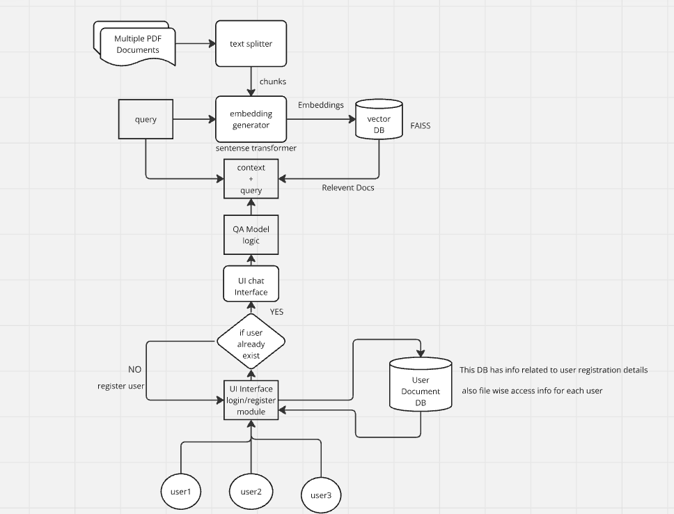
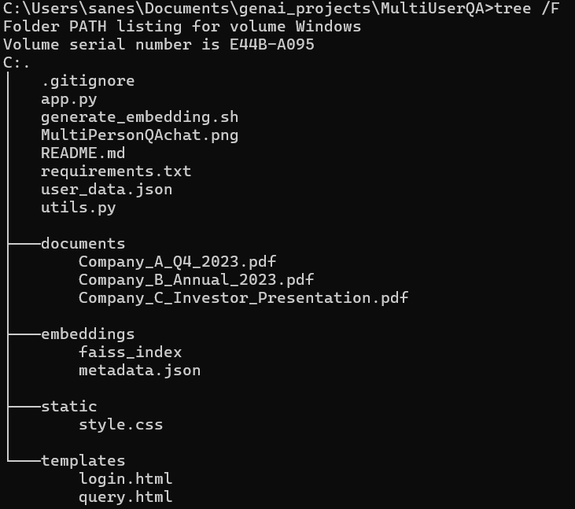

# MultiUserQA
create chatbot with multiusers with context

This repo will do following tasks
1. Cretion of UI to Login multiple users on local system
2. Crete and store embeddings for multiple PDFs in FAISS vector DB
3. DB to get information for user based authented documents
4. Chat Interface by user based on context and from authenticated files 
5. finally logout from UI


### Project Architecture 




### Project folder structure


### execution of code
Run following commands

#### 1. clone repo from this url
```
git clone https://github.com/sivanag004/MultiUserQA.git
cd MultiUserQA
```

#### 2. Install required libraries
```
pip install -r requirements.txt
```

#### 3. Generate embeddings
```
sh generate_embedding.sh
```

#### 4.Run application
```
python app.py

```

It will generate URL http://127.0.0.1:5000
copy this url and paste it in any browser address bar
it will open an login page,give the user mail_id and it will move to chat page, here you can ask questions


